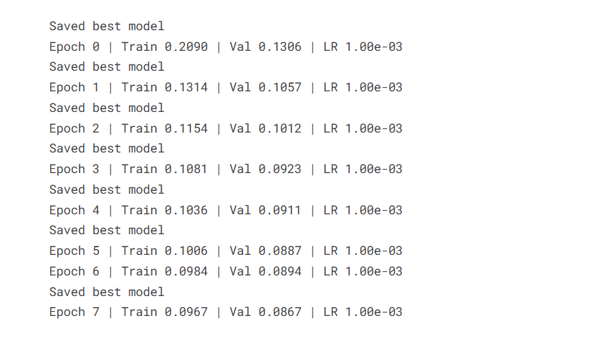
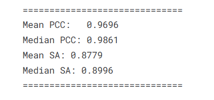

# MS2 Fragment Intensity Prediction using Transformer

## Overview

This project builds a **Transformer-based deep learning model** to
predict **MS2 fragment ion intensities** for peptides.

The model takes as input:

- peptide sequence
- precursor charge
- normalized collision energy (NCE)

and predicts the **fragment ion intensity matrix**.

The output format follows the **pDeep style representation** with shape:

    (29, 6)

where:

- **29** → maximum fragment position\
- **6** → ion types (b1, b2,b3, y1, y2,y3) for each cut index

---

# Dataset

## Source

The dataset used in this project comes from the **Prosit spectral
prediction dataset**.

Link download "https://proteomicsml.org/datasets/fragmentation/ProteomeTools_FI.html"

Typical files:

    traintest_hcd.hdf5
    holdout_hcd.hdf5

The dataset is stored in **HDF5 format**.

Inside the HDF5 file you will find:

    sequence_integer
    precursor_charge_onehot
    collision_energy_aligned_normed
    intensities_raw
    masses_raw

---

# Data Preprocessing

The Prosit intensity vector has size:

    174

It is converted into the pDeep format using:

    prosit_to_pdeep_fast()

Transformation:

    174 → (29,6)

Final tensor format:

    [fragment_position, ion_type]

Invalid fragment positions are masked during training.

---

# Dataset Class

Custom PyTorch dataset:

    PDeepDataset

The dataset loads preprocessed tensors:

    seq.pt
    charge.pt
    nce.pt
    targets.pt

Each sample returns:

    sequence
    charge
    nce
    target
    mask

Example shapes:

    sequence: (max_len)
    charge: (1)
    nce: (1)
    target: (29,6)
    mask: (29)

---

# Model Architecture

The model implemented in the notebook:

    ModelMS2Transformer

### 1. Sequence Embedding

Transforms amino acid tokens into dense vectors.

    Embedding → hidden dimension

### 2. Positional Encoding

Adds positional information to the peptide sequence.

    sin / cos positional encoding

### 3. Metadata Embedding

Additional peptide metadata:

- precursor charge
- collision energy

Encoded using:

    MetaEmbedding

### 4. Transformer Encoder

The core model uses multiple transformer layers.

### 5. Output Layer

Final linear layer predicts fragment intensities.

Output shape:

    (batch_size, 29, 6)

---

# Loss Function

A **masked L1 loss** is used.

Only valid fragments contribute to the loss.

    masked_l1_loss(pred, target, mask)

Steps:

1.  Compute absolute difference
2.  Apply fragment mask
3.  Sum valid fragment errors
4.  Normalize by number of valid fragments

This prevents padded fragments from affecting training.

---

# Training

---

### The model was trained for **8 epochs** using the **Adam optimizer** with a learning rate of **1e-3**.

# Metrics

### The model performance is evaluated using **PCC (Pearson Correlation Coefficient)** and **SA (Spectral Angle)**.

# Running the Notebook

Open:

    tf-alphapeptdeep-ms2-5-3.ipynb

Steps:

1.  Set dataset path
2.  Load HDF5 dataset
3.  Convert dataset to PyTorch tensors
4.  Create dataset object
5.  Train the transformer model

---

# Example Prediction

Model input:

    sequence
    charge
    nce

Model output:

    (29,6)

Predicted intensities are compared with ground truth spectra.

---

# Requirements

    torch
    numpy
    h5py
    tqdm

Install:

    pip install torch h5py tqdm

---

# Result

The model successfully learns to predict MS2 fragment ion intensities.

Training loss decreases steadily, indicating that the transformer
captures peptide fragmentation patterns.

Predicted spectra show good agreement with the ground truth spectra.
